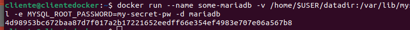
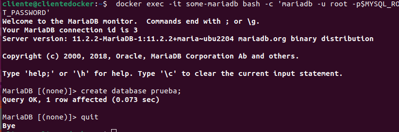
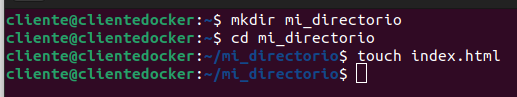

# Docker 3 - Almacenamiento en Docker

> Javier González Díaz

## Ejemplo 2: Contenedor mariadb con almacenamiento persistente

Si estudiamos la documentación de la imagen mariadb en Docker Hub, nos indica que podemos
crear un contenedor con información persistente de mariadb, de la siguiente forma

```bash
$ docker run --name some-mariadb -v /home/$USER/datadir:/var/lib/mysql -e
MYSQL_ROOT_PASSWORD=my-secret-pw -d mariadb
```



Es decir, se va a crear un directorio /home/usuario/datadir en el host, donde se va a guardar la
información de la base de datos. Si tenemos que crear de nuevo el contenedor indicaremos ese
directorio como bind mount y volveremos a tener accesible la información

```bash
$ cd datadir
$ ls
```


```bash
$ docker exec -it some-mariadb bash -c 'mariadb -u root -p$MYSQL_ROOT_PASSWORD'
```



```bash
$ docker rm -f some-mariadb
```


```bash
$ docker run --name some-mariadb -v /home/$USER/datadir:/var/lib/mysql -e
MYSQL_ROOT_PASSWORD=my-secret-pw -d mariadb
```


## Ejercicios

### Volúmenes

1.Crea un volumen docker que se llame **miweb** .

```bash
$ docker volume create miweb
```


2.Crea un contenedor desde la imagen php:7.4-apache donde montes en el directorio /var/www/html (que sabemos que es el DocumentRoot del servidor que nos ofrece esa imagen) el volumen docker que has creado.

```bash
$ docker run -d -p 8080:80 -v miweb:/var/www/html php:7.4-apache
```


3.Utiliza el comando docker cp para copiar un fichero index.html en el directorio /var/www/html .

```bash
$ docker cp index.html gallant_hawking:/var/www/html/
```


4.Accede al contenedor desde el navegador para ver la información ofrecida por el fichero index.html .


5.Borra el contenedor

```bash
$ docker rm gallant_hawking -f
```


6.Crea un nuevo contenedor y monta el mismo volumen como en el ejercicio anterior.

```bash
docker run -d -p 8080:80 --name contenedor2 -v miweb:/var/www/html php:7.4-apache
```


7.Accede al contenedor desde el navegador para ver la información ofrecida por el fichero index.html . ¿Seguía existiendo ese fichero?


### Bind Mount

1. Crea un directorio en tu host y dentro crea un fichero index.html .

   ```bash
   $ mkdir mi_directorio
   $ cd mi_directorio
   $ touch index.html
   ```

   

2. Crea un contenedor desde la imagen php:7.4-apache donde montes en el directorio

/var/www/html el directorio que has creado por medio de bind mount .	

```bash
$ docker run -d -p 8080:80 --name mi_contenedor -v $(pwd)/mi_directorio:/var/www/html php:7.4-apache
```


3. Accede al contenedor desde el navegador para ver la información ofrecida por el fichero

index.html .


4. Modifica el contenido del fichero index.html en tu host y comprueba que al refrescar la

página ofrecida por el contenedor, el contenido ha cambiado.


5. Borra el contenedor

```bash
$ docker stop mi_contenedor
$ docker rm mi_contenedor
```


6. Crea un nuevo contenedor y monta el mismo directorio como en el ejercicio anterior.

```bash
$ docker run -d -p 8080:80 --name mi_contenedor -v $(pwd)/mi_directorio:/var/www/html php:7.4-apache
```


7. Accede al contenedor desde el navegador para ver la información ofrecida por el fichero

index.html . ¿Se sigue viendo el mismo contenido?

Sí
